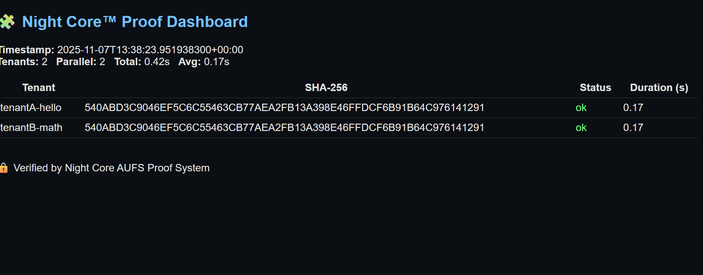
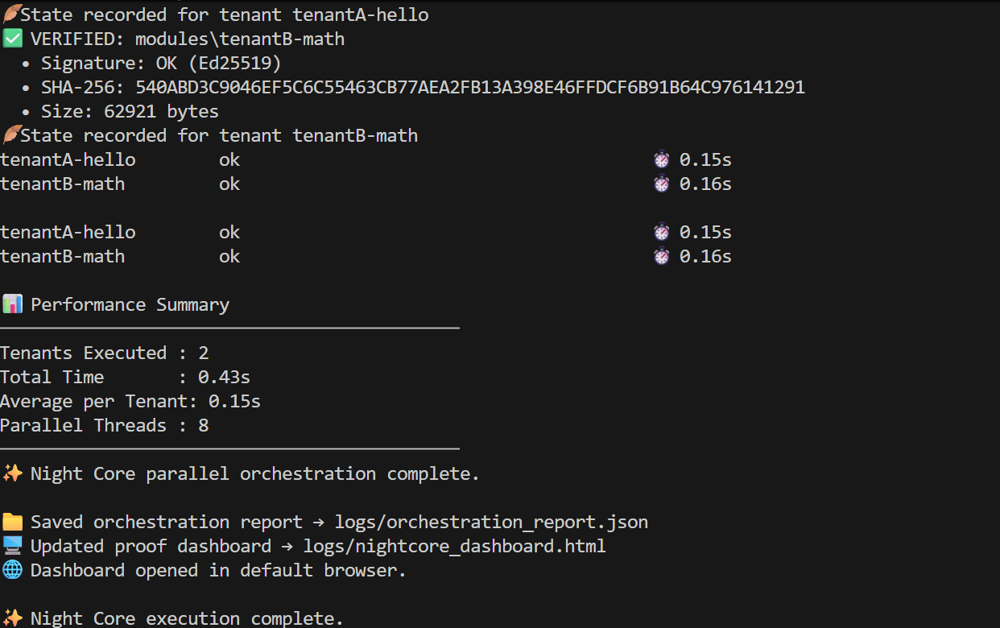
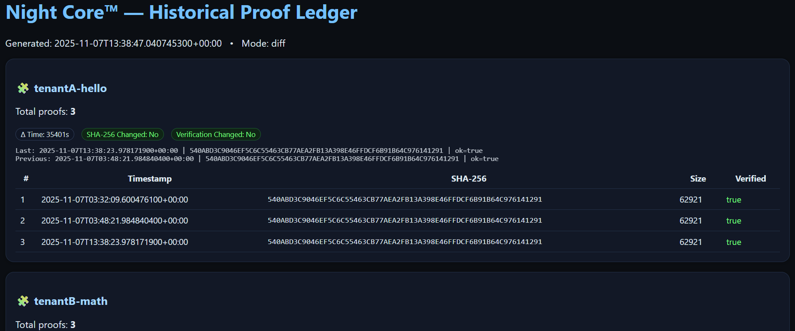

🔍 What Is Night Core Worker?
---------------------------------------------

Night Core™ Worker is an open-core Rust framework for securely running WebAssembly (WASM) modules in isolated sandboxes.
It automatically discovers, verifies, and executes all trusted tenant modules under /modules, ensuring every execution is cryptographically proven.

🖥️ Proof & Dashboard System (v39)
<p align="center"> <br/> <sub><b>Night Core™ v39 — Proof Dashboard:</b> Live verification view showing Ed25519 + SHA-256 validated tenants.</sub> </p> <p align="center"> <br/> <sub><b>Night Core™ v39 — Orchestration Summary:</b> Parallel tenant execution metrics and integrity status.</sub> </p> <p align="center"> <br/> <sub><b>Night Core™ v39 — Historical Proof Ledger:</b> Aggregated multi-tenant state history from <code>export-dashboard --diff</code>.</sub> </p>

Night Core Worker uses:
    • 🦀 Rust for reliability & performance
    • 🔒 Ed25519 digital signatures for authenticity
    • 🧱 SHA-256 integrity hashes for tamper detection
    • 🧩 Wasmtime 37 + WASI Preview 1 for secure sandboxing
    • 📄 HTML + JSONL audit logs for transparency

⸻

⚙️ Quick Start

1️⃣ Clone & Build
```bash
git clone https://github.com/xnfinite/nightcore-worker.git
cd nightcore-worker
cargo +nightly build
```

2️⃣ Generate Keys
```bash
cargo +nightly run -- generate-keys
```
Creates Ed25519 public/private key pairs under /keys/maintainers/.

3️⃣ Sign Your Modules
```bash
cargo +nightly run -- sign --dir modules/tenantA-hello --key keys/maintainers/admin1.key
```
Generates:
- module.sig — Ed25519 signature
- pubkey.b64 — public key in base64
- module.sha256 — integrity hash

4️⃣ Run All Tenants
```bash
cargo +nightly run -- run --all
```
Automatically verifies every module signature and SHA-256 hash before sandbox execution.
Logs are written to:
- logs/nightcore_dashboard.html — visual audit dashboard
- logs/orchestration_report.json — structured JSONL proof report

---

🧾 Security Model
---------------------------------------------

Night Core™ Worker enforces a trustless execution model, ensuring every tenant module runs inside a verifiable, cryptographically protected sandbox.

🔐 Core Guarantees

| Layer | Mechanism | Purpose |
|-------|------------|----------|
| Authenticity | Ed25519 digital signatures | Confirms each .wasm module originates from a trusted maintainer. |
| Integrity | SHA-256 hash verification | Detects any unauthorized modification before execution. |
| Isolation | Wasmtime 37 + WASI P1 | Provides memory, syscalls, and execution limits for each tenant. |
| Accountability | JSONL + HTML audit logs | Every event, signature, and result is recorded in tamper-evident format. |
| Resilience | Multi-tenant orchestration | Faults in one tenant do not affect others. |

⚙️ Execution Flow
1. Discovery → All tenants under /modules are enumerated.
2. Verification → Each module’s .sig and .sha256 are checked using Ed25519.
3. Isolation → The module runs inside a secure Wasmtime/WASI sandbox.
4. Proof Logging → Results are written to logs/ for full reproducibility.

---

📦 Project Structure
---------------------------------------------

nightcore-worker/
│
├── Cargo.toml
│
├── src/
│   ├── main.rs
│   ├── generate_keys.rs
│   ├── sign_tenant.rs
│   ├── verify.rs
│   └── run.rs
│
├── modules/
│   ├── tenantA-hello/
│   │   ├── module.wasm
│   │   ├── module.sig
│   │   ├── module.sha256
│   │   ├── pubkey.b64
│   │   └── manifest.json
│   └── tenantB-math/
│       └── ...
│
├── logs/
│   ├── nightcore_dashboard.html
│   └── orchestration_report.json
│
└── keys/
    └── maintainers/
        ├── admin1.key
        └── admin1.pub

---

🧠 Architecture Overview
---------------------------------------------

Night Core™ Worker is designed as a modular, auditable orchestration engine built around three tightly integrated layers:

1️⃣ Verification Layer
- Handles trust and proof before execution.
- Validates Ed25519 signatures and SHA-256 hashes.
- Rejects any module that fails verification with full audit context.

2️⃣ Execution Layer
- Provides secure sandboxed execution using Wasmtime 37 + WASI P1.
- Enforces per-tenant fuel, memory, and time limits.
- Supports sequential and parallel execution modes.

3️⃣ Audit Layer
- Writes HTML and JSONL logs for transparency.
- Includes timestamps, SHA-256 digests, and status codes.
- Supports proof-only verification mode (--proof).

🏗️ Layer Interaction
Verification → Execution → Audit (Proof Chain)

---

💡 Extending Night Core
---------------------------------------------

Night Core™ Worker is built to scale — adding new tenants or workloads is fast, secure, and verifiable.

1️⃣ Create a New Tenant Directory
mkdir modules/tenantC-ai

2️⃣ Add Your WebAssembly Module
modules/tenantC-ai/module.wasm

3️⃣ Sign the Module
cargo +nightly run -- sign --dir modules/tenantC-ai --key keys/maintainers/admin1.key

4️⃣ Define Tenant Metadata
manifest.json:
{
  "tenant": "tenantC-ai",
  "description": "AI inference module running under WASI sandbox",
  "version": "1.0.0",
  "maintainer": "core-ops",
  "permissions": { "network": false, "filesystem": false }
}

5️⃣ Verify & Run
cargo +nightly run -- run --all

✅ Discover → Verify → Execute → Log

---

🧱 Technology Stack
---------------------------------------------

| Layer | Technology | Purpose |
|--------|-------------|----------|
| Runtime | Rust + Cargo (nightly) | Safety, concurrency, performance |
| Sandbox | Wasmtime 37 + WASI P1 | Deterministic, secure WASM runtime |
| Crypto | Ed25519 (ed25519-dalek) | Authenticity verification |
| Integrity | SHA-256 (sha2 crate) | Tamper detection |
| Serialization | Serde + JSONL | Audit transparency |
| Logging | HTML + JSON reports | Readable dashboards and proofs |

---

⚡ Night Core™ Pro (Coming Soon)
---------------------------------------------

Night Core™ Pro extends the open-core Worker framework into a fully autonomous orchestration platform, integrating advanced systems for verified upgrades and enterprise governance.

🧩 Included & Verified
- ✅ Full AUFS (Autonomous Upgrade & Fork System)

🚧 In Progress
- 🛡️ Guardian Layer — advanced tenant containment & policy control
- ☁️ AWS Integration — Nitro Enclaves, KMS, Fargate support

🪪 Availability
Night Core™ Pro will be available soon as a verified binary distribution for professional and enterprise environments.
Follow updates in docs/legacy/Night_Core_Chronicle.md or the official GitHub repository.

---

📜 License & Credits
---------------------------------------------

- License: MIT (open-core)
- Trademark: “Night Core™” and “B106 Edition” are proprietary marks of B106 Labs
- Core Repository: https://github.com/xnfinite/nightcore-worker

---

🏛️ Open-Core Policy
---------------------------------------------

Night Core™ Worker is released under the **MIT License** as a fully open-core framework.  
It is intended for developers, researchers, and security engineers who wish to explore or build on verified WebAssembly orchestration.  
All advanced systems — including **AUFS (Autonomous Upgrade & Fork System)**, **Guardian Layer**, **Vesper AI**, and **AWS Integration** — are part of **Night Core™ Pro**, a closed-source commercial edition.  

The open-core edition will remain free and maintained for transparency, education, and collaboration, while Night Core™ Pro continues advancing the enterprise feature set.

---
